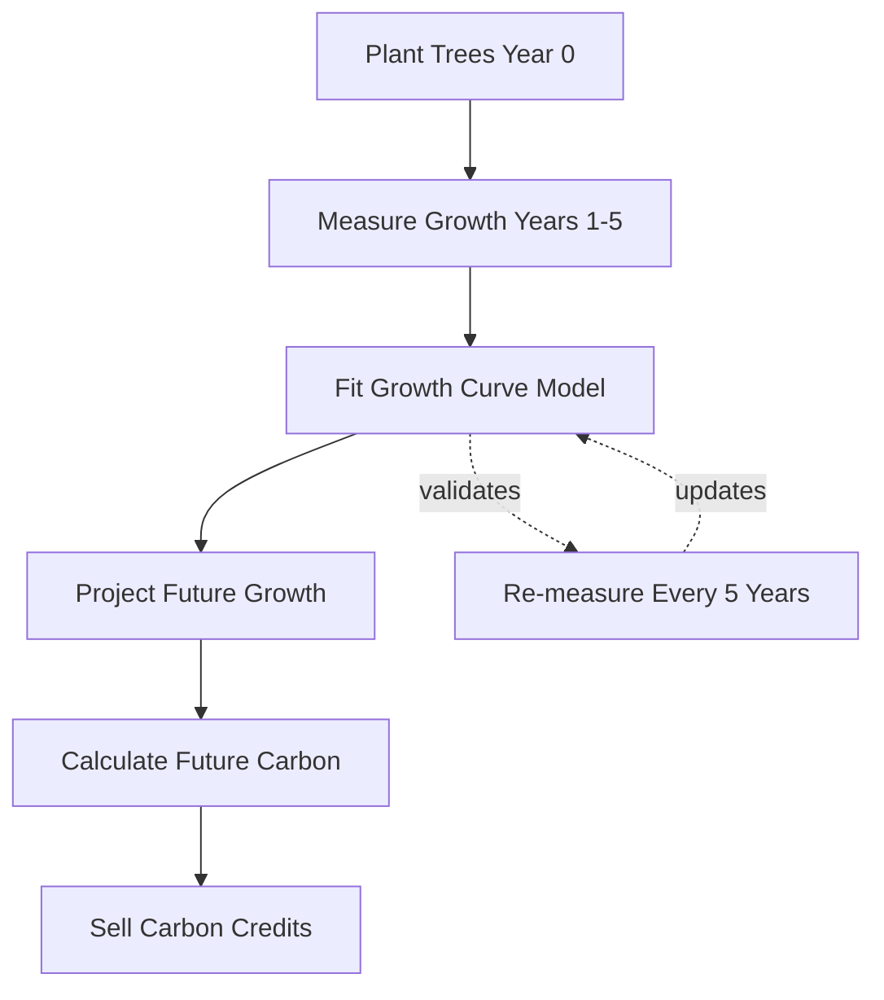

---
tags:
source: "[[2017_AN_forestMensuration_johnEtAll]]"
---
**Afforestation, Reforestation, and Restoration projects** - planting trees to capture carbon and generate carbon credits.

## Why I Need to Understand This

ARR projects need to:
1. **Prove carbon sequestration** - how much CO₂ trees capture
2. **Project future growth** - predict carbon stocks years ahead
3. **Monitor over time** - verify actual vs predicted growth

**Key question:** "How much carbon will my forest store in 10, 20, 30 years?"

## To Answer This, I Need [[Growth Curves]]

Growth curves tell me:
- How trees grow over time
- When growth is fastest
- When trees approach maximum size
- How to predict future biomass

## The Basic ARR Workflow

## What I'll Measure

**In the field:**
- [[tree diameter]]
- [[tree height]]
- Number of surviving trees

**What I need to predict:**
- Total biomass at year 10, 20, 30...
- Carbon stocks
- Annual carbon increment

**How I connect them:** [[Growth Curves]]

## Real Example

**Scenario:** I plant 100 hectares of trees

**Year 1-5:** Measure sample plots
- Year 1: Average [[biomass]] = 2 tC/ha
- Year 3: Average biomass = 12 tC/ha  
- Year 5: Average biomass = 28 tC/ha

**Using [[Growth Curves]]:** Fit model to this data

**Result:** Model predicts
- Year 10: 65 tC/ha
- Year 20: 98 tC/ha
- Year 30: 125 tC/ha

**Carbon credits:** Can sell credits for predicted future carbon (with verification)

## Key Concept

**I can't wait 30 years to know how much carbon my forest will store!**

**Solution:** Use [[Growth Curves]] fitted from early data (years 1-5) to project decades ahead.

## Next Steps to Understand

To fully grasp ARR implementation, I need to understand:
1. [[Growth Curves]] ← **Start here**
2. How to measure trees in the field
3. How to convert measurements to carbon
4. How to verify predictions

---

**Bottom line:** ARR projects live or die by growth projections. [[Growth Curves]] are the tool that makes those projections possible.